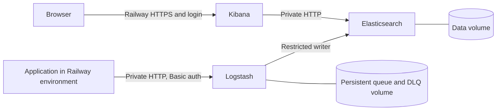

[](https://railway.com/deploy/KPF5VY?utm_source=github-readme&utm_medium=referral&utm_campaign=elk-launch)

# ELK Stack: Elasticsearch, Logstash, Kibana

Authenticated JSON logs, persistent storage, and Kibana search on Railway.

[Try the live demo](https://kibana-production-43ee.up.railway.app/app/dashboards#/view/showcase-commerce).
Log in with username `demo` and password `PublicDemo2026!`.
This shared account has read-only access to synthetic logs.

## 30-second quickstart

This is a short checklist, not a measured deployment-time promise. Image builds
and startup take additional time.

1. Click Deploy on Railway.
2. Wait for each service to become healthy. Open Kibana's HTTPS domain.
3. Log in as `elastic` using Elasticsearch's `ELASTIC_PASSWORD` variable.
4. In an application in the same Railway project and environment, set:

```text
LOGSTASH_URL=http://${{Logstash.RAILWAY_PRIVATE_DOMAIN}}:8080
LOGSTASH_PASSWORD=${{Logstash.INPUT_PASSWORD}}
```

Send an event from that application:

```bash
curl --fail-with-body --user "shipper:$LOGSTASH_PASSWORD" \
  -H 'Content-Type: application/json' "$LOGSTASH_URL" \
  -d '{"message":"hello from Railway","service":"my-app","level":"info"}'
```

In Kibana, open **Analytics → Discover → Create a data view**. Use index pattern
`elk-logs` and time field `@timestamp`. Search `message : "hello from Railway"`.
An intake success means accepted. Finding the event confirms indexing.

The private URL is reachable from the same environment, not from your laptop.
See [Node, Python and Go examples](examples/README.md) and
[Railway configuration](TEMPLATE.md).

## Architecture



Only Kibana is public. Private service traffic is unencrypted HTTP inside the
Railway environment. Do not expose Elasticsearch or Logstash publicly with this configuration.

## What you get

- Official Elastic images pinned by version and digest in the Dockerfiles.
- Basic-auth JSON intake with a restricted Elasticsearch writer.
- Persistent Elasticsearch data and Logstash queue storage.
- Kibana saved objects stored in Elasticsearch and stable encryption keys.
- Log rollover and retention for new volumes. Defaults are configuration choices
  documented in [operations](OPERATIONS.md), not measured capacity guarantees.

Application logs must be sent explicitly. Railway platform logs are not collected
automatically. This is a single-node stack. Volumes provide persistence, not high
availability or backups. [Operations](OPERATIONS.md) covers rotation, retention,
DLQ inspection, snapshots and upgrade recovery.

## Measured cost

A historical idle test sampled **3.213315072 GB RAM** and **0.113354225 vCPU**
over **240.017102 seconds**. At the cited Railway rates, maintaining those means
would cost **$34.40/month for RAM and CPU**. This is arithmetic from a short sample,
not a monthly invoice or a load forecast. Storage, public egress and workspace
subscription/credits affect the bill. See [COST.md](COST.md) for raw samples,
timestamps, rates and limitations.

## FAQ

**Can I send logs from my laptop?** The default intake is private. Run the examples
in a service in the same project/environment. Local tests use a local receiver.

**Where are arbitrary properties stored?** Put searchable application properties
in `attributes`. Unknown top-level fields remain in `_source` but are not indexed.

**Does an HTTP success guarantee delivery?** No. Check Discover. Permanent indexing
errors can enter the bounded DLQ. Timeouts and retries can produce duplicates.

**Is it free or highly available?** Neither is promised. Free/Trial compatibility
and sustained-load capacity were not validated. Review costs and backups before use.

**Is everything MIT licensed?** Custom repository source is MIT. Elastic images
retain their upstream licenses. See [NOTICE.md](NOTICE.md).

## Troubleshooting

| Symptom | Check |
|---|---|
| Login fails | Use `elastic`, not `kibana_system`. Read the original generated password from Elasticsearch. Changing a variable alone does not rotate a persisted user. |
| Intake rejects credentials | Use username `shipper` and Logstash's `INPUT_PASSWORD`. Keep producer variables aligned. |
| Private hostname does not resolve | Run the producer in the same Railway project and environment. |
| Accepted event missing | Select `elk-logs`, widen the time range, check Logstash output errors and DLQ. |
| Startup fails | Check Elasticsearch first, then consumer logs. Preserve volumes, original secrets and encryption keys. |
| Recovery fails after upgrade | Do not downgrade Elasticsearch against upgraded data. Restore a verified compatible snapshot into a separate stack. |

For configuration rollback, redeploy the last verified source with unchanged
versions, secrets and volumes, then verify intake and search. Never delete data
to repair a password mismatch.

## Development

```bash
python3 -m pip install -r requirements-dev.txt
python3 scripts/lint.py
python3 scripts/test_examples.py
bash scripts/build.sh
```

CI lints configuration, tests the examples, builds each image without publishing,
and checks the Logstash pipeline using its built image. See [CONTRIBUTING](CONTRIBUTING.md)
and [local validation evidence](docs/VALIDATION.md).
